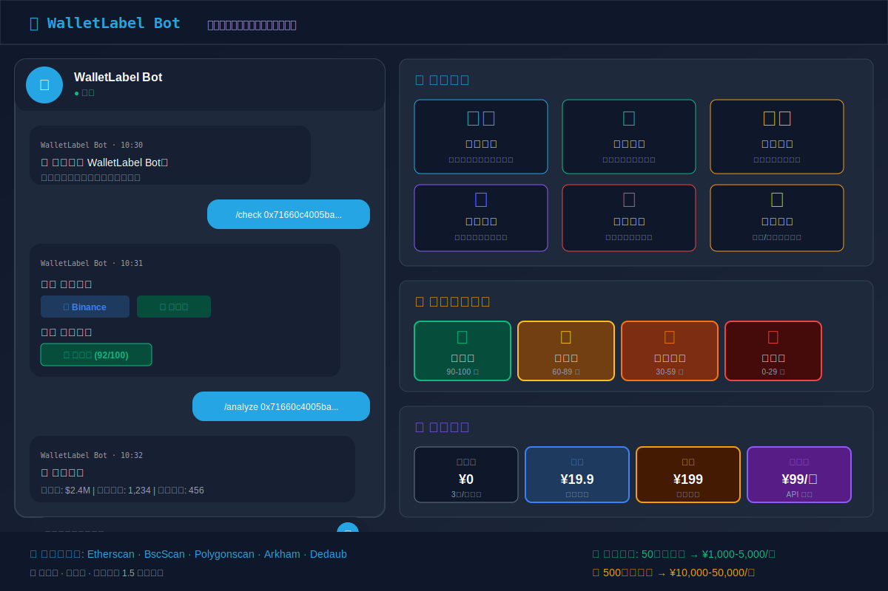

# 🎯 WalletLabel Bot - 钱包地址标签查询机器人

<p align="center">
  
  
  
  
  
</p>

<p align="center">
  
  
  
  
</p>

一个轻运营、零成本的 Telegram 机器人，帮助用户查询加密货币钱包地址的标签、持仓分析和风险评级。

## 🖼️ 项目预览

<p align="center">
  
</p>

## ✨ 核心功能

- 🏷️ **地址标签查询** - 识别交易所、大户、黑客、合约等地址
- 📊 **持仓分析** - 分析地址的持仓分布和盈亏情况
- 🔄 **交易历史** - 统计交易频率、偏好币种
- ⚠️ **风险评级** - 智能评估地址风险等级
- 🔍 **批量查询** - 支持一次查询多个地址
- 👥 **会员系统** - 免费/付费分层运营

## 🚀 快速开始

### 1. 安装依赖
```bash
cd wallet-label-bot
pip install -r requirements.txt
```

### 2. 配置环境变量
```bash
cp .env.example .env
# 编辑 .env，填入你的 Bot Token
```

### 3. 启动机器人
```bash
python run_bot.py
```

### 4. 在 Telegram 中使用
搜索你的机器人，发送 `/start` 开始使用。

## 💰 变现模式

| 套餐 | 价格 | 查询次数 | 功能 |
|------|------|----------|------|
| 免费版 | ¥0 | 3次/天 | 基础标签查询 |
| 月卡 | ¥19.9 | 无限 | 全部功能 + 持仓分析 |
| 年卡 | ¥199 | 无限 | 全部功能 + 批量查询 |
| 专业版 | ¥99/月 | 无限 | 全部功能 + API 接口 |

### 盈利预估
- 50个付费用户：¥1,000-5,000/月
- 200个付费用户：¥4,000-20,000/月
- 500个付费用户：¥10,000-50,000/月

## 📱 用户命令

| 命令 | 说明 |
|------|------|
| `/start` | 开始使用 |
| `/help` | 获取帮助 |
| `/check [地址]` | 查询地址标签 |
| `/analyze [地址]` | 深度分析地址 |
| `/risk [地址]` | 风险评级 |
| `/batch [地址1,地址2,...]` | 批量查询 |
| `/subscribe` | 升级会员 |
| `/profile` | 查看个人信息 |
| `/invite` | 邀请好友 |

## 🎯 地址标签类型

### 交易所
- Binance、Coinbase、OKX、Huobi、KuCoin 等

### 机构/大户
- 加密鲸鱼、投资机构、做市商

### 风险地址
- 黑客地址、诈骗地址、洗钱地址

### 合约地址
- Token 合约、NFT 合约、DeFi 协议

### DeFi 协议
- Uniswap、Aave、Compound 等

## 📊 风险评级

| 等级 | 分数 | 说明 |
|------|------|------|
| 🟢 低风险 | 90-100 | 知名交易所、合规机构 |
| 🟡 中风险 | 60-89 | 普通用户、未知地址 |
| 🟠 较高风险 | 30-59 | 频繁小额交易、新地址 |
| 🔴 高风险 | 0-29 | 黑客、诈骗、黑名单地址 |

## 🏗️ 项目结构

```
wallet-label-bot/
├── config/              # 配置模块
├── core/                # 核心引擎
│   ├── label_engine.py     # 标签查询引擎
│   ├── analysis_engine.py  # 持仓分析引擎
│   ├── risk_engine.py      # 风险评级引擎
│   └── blockchain_api.py   # 区块链 API 封装
├── bot/                 # Telegram Bot
│   ├── commands.py        # 命令处理
│   ├── handlers.py        # 回调处理
│   └── utils.py           # 工具函数
├── models/              # 数据模型
│   ├── database.py        # 数据库
│   ├── user.py            # 用户模型
│   └── address_cache.py   # 地址缓存
├── data/                # 数据目录
│   ├── labels/            # 标签数据库
│   └── wallet_bot.db      # SQLite 数据库
├── .env.example         # 环境变量示例
├── requirements.txt     # Python 依赖
├── run_bot.py           # 启动 Bot
└── README.md            # 项目说明
```

## 🛠️ 技术栈

- **Python 3.9+**
- **python-telegram-bot** - Telegram Bot 框架
- **SQLite** - 数据库
- **Etherscan API** - 区块链数据
- **Requests** - HTTP 请求
- **Loguru** - 日志记录

## 🌐 免费数据源

- **Etherscan** - 以太坊数据（免费 API Key）
- **BscScan** - BSC 数据（免费 API Key）
- **Polygonscan** - Polygon 数据（免费 API Key）
- **Arkham Public API** - 地址标签
- **Dedaub Public API** - 地址标签
- **WalletExplorer** - 公开标签数据库

## 🎯 冷启动策略

### 第一周：种子用户
1. 免费开放所有功能 7 天
2. 在加密货币社群推广
3. 联系 5-10 个 KOL 免费试用

### 第二周：转化付费
1. 免费用户限制每日 3 次查询
2. 推出首月半价优惠
3. 邀请好友双方各得 7 天会员

### 第三周：病毒传播
1. 分享查询结果到群可获得额外查询次数
2. 建立 VIP 社群，提供专属分析
3. 推出团队版套餐

## ⏰ 运营时间

每周仅需 **1.5 小时**：
- 周一：回复积压问题（30分钟）
- 周三：检查运行状态（10分钟）
- 周五：更新标签数据库（30分钟）
- 周日：复盘优化（30分钟）

## 🗺️ 路线图 (Roadmap)

### 短期目标 (v1.1.0)
- [ ] 支持更多公链（Solana、Avalanche、Fantom、Optimism）
- [ ] 添加 NFT 持仓分析
- [ ] 实现 DeFi 协议交互追踪
- [ ] 添加地址交易行为画像
- [ ] 支持批量地址导入导出

### 中期目标 (v1.2.0)
- [ ] 集成 Etherscan、BSCscan 等区块浏览器 API
- [ ] 添加鲸鱼钱包追踪功能
- [ ] 实现智能合约安全审计
- [ ] 添加价格预警和通知系统
- [ ] 支持多语言（中文、英文、日文）

### 长期目标 (v2.0.0)
- [ ] 支持跨链交易追踪
- [ ] 添加 AI 驱动的风险评估模型
- [ ] 实现投资组合收益分析
- [ ] 开发 Web 版管理后台
- [ ] 支持 API 接口供第三方集成

### 功能增强
- [ ] 添加地址标签众包标注系统
- [ ] 实现交易模拟和回测功能
- [ ] 添加社交功能（关注地址、分享分析）
- [ ] 支持自定义风险评估规则
- [ ] 开发 Discord 机器人版本

### 数据扩展
- [ ] 扩展标签数据库到 100 万+
- [ ] 添加实体关系图谱
- [ ] 支持历史数据回溯查询
- [ ] 添加洗钱交易检测
- [ ] 集成更多数据源（Dune Analytics、Nansen）

## ⚠️ 免责声明

本工具仅供研究和学习使用，不构成任何投资建议。查询结果基于公开数据，仅供参考。

## 🤝 贡献

欢迎提交 Issue 和 Pull Request！

### 如何贡献

1. Fork 本仓库
2. 创建你的功能分支 (`git checkout -b feature/AmazingFeature`)
3. 提交你的更改 (`git commit -m 'Add some AmazingFeature'`)
4. 推送到分支 (`git push origin feature/AmazingFeature`)
5. 开启一个 Pull Request

## 📄 许可证

本项目采用 MIT 许可证 - 详见 [LICENSE](LICENSE) 文件。

## 📞 技术支持

如有问题，请联系开发者。
